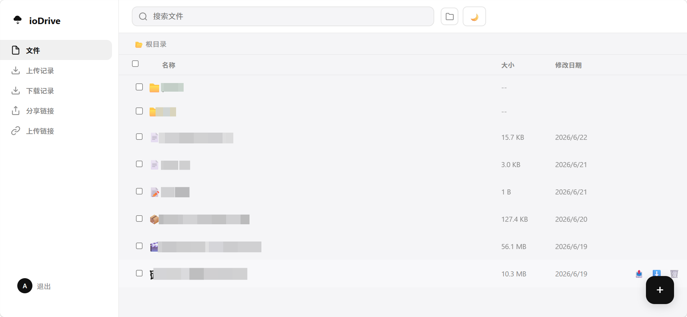
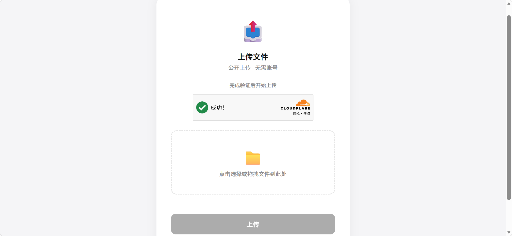
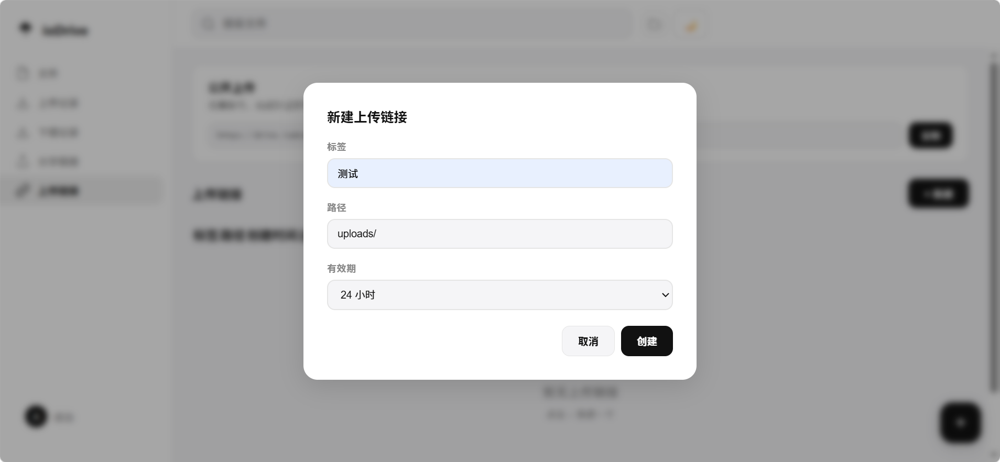
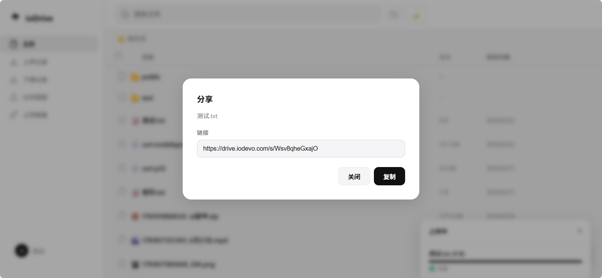
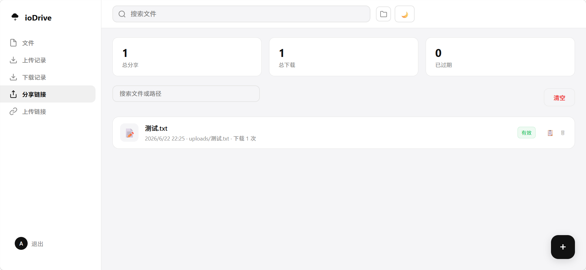
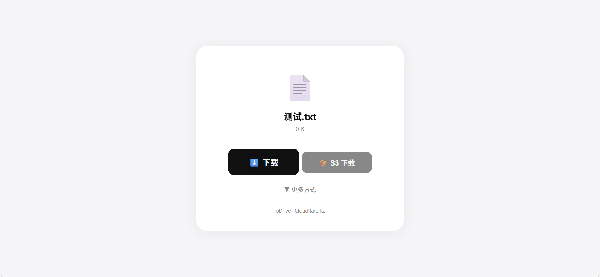
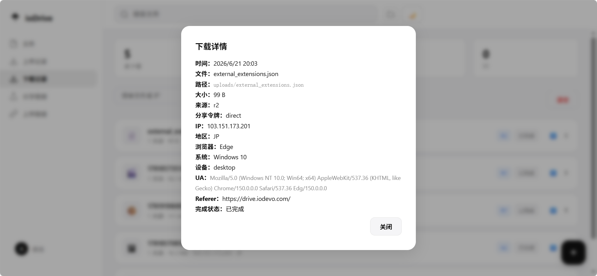

# ioDrive

<p align="center">
  
</p>

<h3 align="center">
  軽量 Cloudflare ファイル共有システム
</h3>

<div align="center">
  <a href="https://demo.iodevo.com">デモサイト</a>
</div>

<p align="center">
  Cloudflare Workers + Hono + R2 で構築された高性能ファイル管理・共有プラットフォーム
</p>

<p align="center">


</p>

<p align="center">

<a href="#-背景">背景</a> ·
<a href="#-スクリーンショット">スクリーンショット</a> ·
<a href="#-機能">機能</a> ·
<a href="#-アーキテクチャ">アーキテクチャ</a> ·
<a href="#-クイックスタート">クイックスタート</a> ·
<a href="#-設定">設定</a> ·
<a href="#-api-リファレンス">API</a> ·
<a href="#-デプロイ">デプロイ</a> ·
<a href="#-ロードマップ">ロードマップ</a>

</p>

<p align="center">

[中文](../README.md) | [English](./README_EN.md) | **日本語**

</p>

---

## 👋 背景

ログイン不要で複数人がダウンロード・アップロードできる適切なクラウドドライブをずっと探していました。市販のクラウドドライブのほとんどはダウンロードにログインが必要で、厳しい速度制限があり、優れたファイル収集システムも見当たりませんでした。そのため、このプロジェクトが生まれました。

ioDrive は、Cloudflare のエッジネットワーク上で完全に動作する軽量ファイル管理システムです。Cloudflare アカウントさえあれば、数分で自分だけのファイル共有プラットフォームをデプロイできます — サーバー不要、データベース不要、運用不要です。

### ioDrive を選ぶ理由

- **ゼロサーバーコスト**：Cloudflare Workers の無料枠内で完全に動作（1日10万リクエスト）
- **無制限のストレージ可能性**：R2 オブジェクトストレージベース、エグレス料金ゼロ
- **超高速アクセス**：世界330以上のデータセンター、ユーザーは最寄りのエッジからダウンロード
- **ワンコマンドでデプロイ**：データベースやサーバーの設定不要
- **安全・信頼性**：JWT 認証 + Turnstile CAPTCHA で悪用を防止

---

## 🚀 ワンクリックデプロイ

### 方法1：セットアップスクリプト（ローカルデプロイに推奨）

対話式のガイドで設定を入力、設定ファイルを自動生成、ワンコマンドでデプロイ：

```bash
git clone https://github.com/Mareixcode/Cloudflare-Drive.git
cd Cloudflare-Drive
chmod +x setup.sh
./setup.sh
```

スクリプトが自動的に以下をガイドします：
- ✅ 前提条件の確認（Node.js、npm、wrangler）
- ✅ Cloudflare アカウント情報の収集
- ✅ ドメインと R2 バケットの設定
- ✅ Turnstile CAPTCHA の設定
- ✅ `wrangler.toml` と `.dev.vars` の生成
- ✅ R2 バケットの自動作成とデプロイ

### 方法2：GitHub Actions ワンクリックデプロイ（継続デプロイに推奨）

> ⚠️ **前提条件**：まずこのリポジトリをあなたの GitHub アカウントに **[Fork](https://github.com/Mareixcode/Cloudflare-Drive/fork)** してください。

**ステップ1：GitHub Secrets の設定**

リポジトリ → **Settings** → **Secrets and variables** → **Actions** に移動し、以下の Secrets を追加：

| Secret 名 | 説明 | 取得方法 |
|-------------|-------------|------------|
| `CLOUDFLARE_API_TOKEN` | Cloudflare API トークン | [トークン作成](https://dash.cloudflare.com/profile/api-tokens) → 「Cloudflare Workers の編集」テンプレート |
| `CLOUDFLARE_ACCOUNT_ID` | アカウント ID | Dashboard ホーム → 右側 API セクション |
| `ADMIN_PASS` | 管理者パスワード | 自分で設定 |
| `JWT_SECRET` | JWT 署名キー | `node -e "console.log(require('crypto').randomBytes(32).toString('hex'))"` を実行 |
| `TURNSTILE_SECRET` | Turnstile シークレット | Turnstile → あなたのサイト → API キー |
| `TURNSTILE_SITE_KEY` | Turnstile サイトキー | Turnstile → あなたのサイト → サイトキー |
| `R2_ACCESS_KEY` | R2 アクセスキー | R2 → R2 API トークンの管理 |
| `R2_SECRET_KEY` | R2 シークレットキー | 同上 |

**ステップ2：デプロイの実行**

リポジトリ → **Actions** → **🚀 ワンクリックデプロイ ioDrive** → **Run workflow** をクリックし、設定パラメータを入力して実行。

**以降の更新**

設定後、`main` ブランチへのプッシュごとに自動デプロイがトリガーされます（既存の `deploy.yml` ワークフロー経由）。

---

## 📸 スクリーンショット

### 管理ダッシュボード



### ファイルアップロード




### 共有ページ






---

## ✨ 機能

### 📁 ファイル管理

- **フォルダ操作**：作成、閲覧、パンくずナビゲーション
- **ファイルアップロード**：ドラッグ＆ドロップ、クリックアップロード、単一ファイルとマルチパートアップロード（>20MB は自動分割）
- **ファイル移動**：ビジュアルフォルダピッカー、ディレクトリ間移動対応
- **バッチ操作**：複数ファイル選択で一括削除、一括共有、一括移動
- **ファイル検索**：現在のディレクトリ内でのリアルタイムファイル名検索
- **同時アップロード**：マルチパートアップロードで最大6並列チャンク

### 🔗 共有システム

- **ワンクリック共有リンク**：単一ファイルとバッチ生成に対応
- **共有リンク管理**：全共有履歴の表示、ダウンロード回数統計
- **広告なしオプション**：オプションの「広告なし」モード（S3 バックアップダウンロードを無効化）
- **安全な削除**：共有リンクの単一または一括削除

### 🌍 パブリックアップロード

- **ログイン不要**：誰でも `/upload` ページからファイルをアップロード可能
- **Turnstile CAPTCHA**：悪意のあるアップロードと濫用を防止
- **アップロードパス設定可能**：環境変数でパブリックアップロード先を指定
- **アップロード元追跡**：`dashboard`、`public`、`upload-key` のソースを区別

### ⏳ アップロードリンク

- **専用アップロードURL**：固有の `/u/:keyId` アップロードページを生成
- **カスタム有効期限**：時間単位でリンクの有効期限を設定
- **保存先ディレクトリ指定**：アップロードリンクごとに異なる保存先フォルダを指定可能
- **一元管理**：作成、表示、削除、使用回数の追跡

### 📊 ダウンロード統計

毎回のダウンロードを詳細に記録：

| フィールド | 説明 |
|------|------|
| IP アドレス | ダウンロード者の IP |
| 国/地域 | Cloudflare IP ジオロケーション |
| ブラウザ | Chrome / Safari / Firefox / Edge 等 |
| オペレーティングシステム | Windows / macOS / iOS / Android / Linux |
| デバイスタイプ | デスクトップ / モバイル / タブレット |
| ダウンロード時刻 | ISO タイムスタンプ |
| ダウンロード元 | R2 / S3 / R2+S3 |
| 共有元 | どの共有リンクからダウンロードされたか |
| 完了状態 | ダウンロードが完了したか（ビーコン追跡） |

### 📊 アップロード統計

毎回のアップロードを詳細に記録：

| フィールド | 説明 |
|------|------|
| IP アドレス | アップロード者の IP |
| 国/地域 | Cloudflare IP ジオロケーション |
| ブラウザ / OS / デバイス | 完全な UA 解析 |
| アップロード元 | `dashboard` / `public` / `upload-key` |
| アップロードリンクラベル | どのアップロードリンクからアップロードされたか |

### ☁️ デュアルストレージ対応

- **Cloudflare R2**（プライマリ）：エグレス料金ゼロ
- **オプション S3 同期**：R2 と S3 互換ストレージの両方に同時書き込み
- **対応 S3 互換プラットフォーム**：AWS S3、Cloudflare R2（S3 API 経由）、MinIO、Backblaze B2、Tencent COS、Alibaba OSS 等
- **デュアルチャンネルダウンロード**：共有ページで R2 と S3 の両方の事前署名付きダウンロードリンクを提供

### 🌙 ユーザーエクスペリエンス

- **ダークモード**：ワンクリック切替、設定は localStorage に保存
- **レスポンシブレイアウト**：デスクトップ、タブレット、モバイルに対応
- **モバイルサイドバー**：下部ナビゲーションバー + 折りたたみサイドメニュー
- **アップロードプログレスバー**：リアルタイムのアップロード進捗表示（単一・マルチパート両対応）
- **クリップボードコピー**：共有リンクをワンクリックでコピー
- **Curl / Aria2 コマンド**：共有ページで CLI ダウンロードコマンドを自動生成

---

## 🏗️ アーキテクチャ

```text
┌──────────────────────────┐
                          │     Cloudflare Worker     │
                          │     (Hono Framework)      │
                          │                           │
        ┌─────────────────┼───────────────────────────┼─────────────────┐
        │                 │                           │                 │
   ┌────▼────┐      ┌─────▼──────┐           ┌───────▼──────┐   ┌──────▼──────┐
   │  JWT    │      │   File     │           │   Share      │   │   Upload    │
   │  Auth   │      │   CRUD     │           │   Service    │   │   Service   │
   └─────────┘      └─────┬──────┘           └───────┬──────┘   └──────┬──────┘
                          │                          │                 │
                          └──────────┬───────────────┘                 │
                                     │                                 │
                              ┌──────▼──────┐                   ┌──────▼──────┐
                              │  Cloudflare │                   │  Cloudflare │
                              │     R2      │                   │  Turnstile  │
                              └──────┬──────┘                   └─────────────┘
                                     │
                              ┌──────▼──────┐
                              │  オプション  │
                              │  S3 同期    │
                              └─────────────┘
```

### データストレージ設計

ioDrive は従来のデータベースに依存せず、すべてのメタデータを JSON ファイルとして R2 に保存します：

| パスプレフィックス | 内容 | 説明 |
|----------|------|------|
| `uploads/` | ユーザーファイル | アップロードされたすべてのファイル |
| `_shares/` | 共有レコード | `{token}.json` に共有メタデータを保存 |
| `_dl_logs/` | ダウンロードログ | `{source}_{ts}_{rand}.json` |
| `_ul_logs/` | アップロードログ | `{source}_{ts}_{rand}.json` |
| `_upload_keys/` | アップロードリンク | `{id}.json` にアップロードリンク設定を保存 |
| `_s3/` | S3 マルチパートメタデータ | S3 マルチパートアップロードの uploadId を一時保存 |

### ダウンロードフロー

```text
ユーザーが /s/:token にアクセス
       │
       ▼
  ファイル情報表示 + Turnstile 検証
       │
       ▼
  ユーザーが Turnstile 検証を完了
       │
       ▼
  POST /api/download/token
       │
       ├──► R2 事前署名付き URL を生成（5分間有効）
       ├──► S3 事前署名付き URL を生成（5分間有効、設定されている場合）
       └──► ダウンロードログを記録
       │
       ▼
  ユーザーがダウンロードリンクをクリック
       │
       ▼
  sendBeacon でダウンロード完了を報告
```

### アップロードフロー

```text
ダッシュボードアップロード          パブリックアップロード / アップロードリンク
     │                                  │
     ├── JWT 認証                       ├── Turnstile 検証
     │                                  ├── アップロードリンク検証（オプション）
     │                                  │
     └──────────┬───────────────────────┘
                │
         ┌──────▼──────┐
         │ サイズ判定   │
         └──────┬──────┘
                │
      ┌─────────┴─────────┐
      │                   │
   ≤ 20MB              > 20MB
      │                   │
  R2 PutObject      R2 CreateMultipartUpload
  + S3 PutObject    │
      │             ├── 同時チャンクアップロード（最大6）
      │             │   R2 uploadPart + S3 uploadPart
      │             │
      │             R2 CompleteMultipartUpload
      │             + S3 CompleteMultipartUpload
      │                   │
      └─────────┬─────────┘
                │
          アップロードログを記録
```

---

## 🧰 技術スタック

<p align="center">


</p>

| 技術 | バージョン | 用途 |
|------|------|------|
| [TypeScript](https://www.typescriptlang.org/) | ^5.0 | 型安全な開発言語 |
| [Hono](https://hono.dev/) | ^4.0 | エッジコンピューティングに最適化された軽量 Web フレームワーク |
| [Cloudflare Workers](https://workers.cloudflare.com/) | - | サーバーレスランタイム、グローバルエッジデプロイ |
| [Cloudflare R2](https://www.cloudflare.com/r2/) | - | オブジェクトストレージ、エグレス料金ゼロ |
| [Cloudflare Turnstile](https://www.cloudflare.com/products/turnstile/) | - | プライバシーに配慮した CAPTCHA |
| [jose](https://github.com/panva/jose) | ^6.0 | JWT 署名と検証（HS256） |
| [Wrangler](https://developers.cloudflare.com/workers/wrangler/) | ^4.0 | Cloudflare CLI 開発・デプロイツール |

### なぜ Hono か？

- Cloudflare Workers 専用に設計され、最小限のランタイムフットプリント
- Express ライクな API、低い学習コスト
- CORS、ミドルウェアなどがビルトイン
- JSX とテンプレート文字列による HTML レンダリングをサポート

### なぜデータベースを使わないのか？

- R2 の `list()` / `get()` / `put()` / `delete()` 操作でメタデータ CRUD に十分
- D1 や外部データベースの設定不要
- 依存関係が少なく、運用の複雑さが低い
- JSON ファイルストレージは柔軟で、エクスポートやバックアップが容易

---

## 🚀 クイックスタート

### 前提条件

- [Node.js](https://nodejs.org/) >= 18
- [Cloudflare アカウント](https://dash.cloudflare.com/sign-up)
- Cloudflare アカウントで **Workers** と **R2** サービスが有効化されていること
- ドメイン（Cloudflare DNS で管理）

### ステップ1：プロジェクトのクローン

```bash
git clone https://github.com/Mareixcode/Cloudflare-Drive.git
cd Cloudflare-Drive
npm install
```

### ステップ2：Cloudflare リソースの設定

#### R2 バケットの作成

1. [Cloudflare ダッシュボード](https://dash.cloudflare.com/) にログイン
2. **R2** → **バケットを作成** に移動
3. バケット名を入力（例：`iodrive`）
4. 後で設定に使用するため、バケット名をメモ

#### R2 API 認証情報の取得

1. **R2** → **R2 API トークンの管理** に移動
2. 「管理者読み取り/書き込み」権限で API トークンを作成
3. **Access Key ID** と **Secret Access Key** をメモ

#### アカウント ID の取得

1. Cloudflare ダッシュボードのホームページに移動
2. 右側の「API」セクションから **Account ID** をコピー

#### Turnstile キーの取得

1. **Turnstile** ページに移動
2. サイトを追加し、「管理」モードを選択
3. **Site Key** と **Secret Key** をメモ

### ステップ3：環境変数の設定

設定ファイルの例をコピー：

```bash
cp wrangler.toml.example wrangler.toml
```

`wrangler.toml` を編集して設定を入力：

```toml
name = "iodrive"
main = "src/index.ts"
compatibility_date = "2024-12-01"
routes = [{ pattern = "YOUR_DOMAIN/*", zone_name = "YOUR_ZONE" }]

[vars]
ADMIN_USER = "admin"
R2_PUBLIC_DOMAIN = "YOUR_R2_PUBLIC_DOMAIN"
R2_BUCKET = "YOUR_R2_BUCKET"
R2_ACCOUNT_ID = "YOUR_R2_ACCOUNT_ID"
TURNSTILE_SITE_KEY = "YOUR_TURNSTILE_SITE_KEY"

# オプション S3 同期
S3_ENDPOINT = "YOUR_S3_ENDPOINT"
S3_BUCKET = "YOUR_S3_BUCKET"
S3_REGION = "YOUR_S3_REGION"
PUBLIC_UPLOAD_PATH = "uploads/public/"

[[r2_buckets]]
binding = "DRIVE"
bucket_name = "YOUR_R2_BUCKET"
```

### ステップ4：シークレットの設定

`wrangler secret` で機密情報を設定：

```bash
# 必須シークレット
wrangler secret put ADMIN_PASS      # 管理者パスワード
wrangler secret put JWT_SECRET      # JWT 署名キー（ランダムな64文字の文字列を推奨）
wrangler secret put TURNSTILE_SECRET # Turnstile シークレット
wrangler secret put R2_ACCESS_KEY   # R2 アクセスキー
wrangler secret put R2_SECRET_KEY   # R2 シークレットキー

# オプション S3 シークレット（S3 同期が必要な場合）
wrangler secret put S3_ACCESS_KEY
wrangler secret put S3_SECRET_KEY
```

> 💡 **JWT_SECRET の生成**：`node -e "console.log(require('crypto').randomBytes(32).toString('hex'))"`

### ステップ5：ローカル開発

ローカル開発用に `.dev.vars` ファイルを作成（このファイルは gitignore されています）：

```bash
# .dev.vars
ADMIN_PASS=your_admin_password
JWT_SECRET=your_jwt_secret
TURNSTILE_SECRET=your_turnstile_secret
R2_ACCESS_KEY=your_r2_access_key
R2_SECRET_KEY=your_r2_secret_key
S3_ACCESS_KEY=your_s3_access_key     # オプション
S3_SECRET_KEY=your_s3_secret_key     # オプション
```

ローカル開発サーバーを起動：

```bash
npm run dev
```

### ステップ6：デプロイ

```bash
npm run deploy
```

デプロイ後、`https://YOUR_DOMAIN` にアクセスして ioDrive を使い始められます。

---

## ⚙️ 設定

### 環境変数完全リファレンス

#### 必須変数（wrangler.toml vars）

| 変数 | 説明 | 例 |
|------|------|------|
| `ADMIN_USER` | 管理者ユーザー名 | `admin` |
| `R2_PUBLIC_DOMAIN` | R2 公開アクセスドメイン | `r2.example.com` |
| `R2_BUCKET` | R2 バケット名 | `iodrive` |
| `R2_ACCOUNT_ID` | Cloudflare アカウント ID | `b06463110442db176b96e67a7fd4eb8e` |
| `TURNSTILE_SITE_KEY` | Turnstile サイトキー（公開） | `0x4AAAAAADnkUbPb8iGro2Vh` |

#### 必須シークレット（wrangler secret）

| 変数 | 説明 |
|------|------|
| `ADMIN_PASS` | 管理者パスワード |
| `JWT_SECRET` | JWT HS256 署名キー（64文字のランダム文字列を推奨） |
| `TURNSTILE_SECRET` | Turnstile シークレット（サーバーサイド検証用） |
| `R2_ACCESS_KEY` | R2 アクセスキー（事前署名付きダウンロード URL 生成用） |
| `R2_SECRET_KEY` | R2 シークレットキー（事前署名付きダウンロード URL 生成用） |

#### オプション変数

| 変数 | 説明 | デフォルト |
|------|------|--------|
| `S3_ENDPOINT` | S3 互換ストレージエンドポイント | - |
| `S3_BUCKET` | S3 バケット名 | - |
| `S3_REGION` | S3 リージョン | - |
| `S3_ACCESS_KEY` | S3 アクセスキー（シークレット） | - |
| `S3_SECRET_KEY` | S3 シークレットキー（シークレット） | - |
| `PUBLIC_UPLOAD_PATH` | デフォルトのパブリックアップロードパス | `uploads/public/` |

### ルート設定

```toml
# 本番環境
routes = [{ pattern = "drive.example.com/*", zone_name = "example.com" }]

# カスタムドメインが不要な場合は workers.dev サブドメインも使用可能
# routes 設定を削除すると <worker-name>.<subdomain>.workers.dev が自動割り当てされます
```

### R2 バケットバインディング

```toml
[[r2_buckets]]
binding = "DRIVE"       # コード内で使用するバインディング名（変更不可）
bucket_name = "iodrive" # あなたの R2 バケット名
```

### CORS 設定

デフォルトでは `/api/*` パスに対してすべてのオリジンが許可されています。制限するには `src/index.ts` を修正：

```typescript
app.use('/api/*', cors({
  origin: 'https://your-domain.com',
  allowMethods: ['GET', 'POST', 'DELETE'],
}));
```

---

## 📁 プロジェクト構造

```
drive/
├── .github/
│   └── workflows/
│       └── ci.yml                    # GitHub Actions CI/CD 設定
├── docs/
│   ├── README_EN.md                  # 英語ドキュメント
│   ├── README_JA.md                  # 日本語ドキュメント
│   └── images/
│       ├── logo/
│       │   └── logo.svg              # プロジェクトロゴ
│       └── screenshots/
│           ├── dashboard.jpg         # 管理ダッシュボードのスクリーンショット
│           ├── upload.png            # アップロードのスクリーンショット
│           ├── upload-link-1.png     # アップロードリンクのスクリーンショット
│           ├── share.png             # 共有のスクリーンショット
│           ├── share-1.png           # 共有のスクリーンショット - モバイル
│           ├── share-link-1.png      # 共有リンクのスクリーンショット - デスクトップ
│           └── share-link-2.png      # 共有リンクのスクリーンショット - CLIダウンロード
├── src/
│   ├── index.ts                      # 🚀 アプリエントリ：ルート登録、ページルート、SEO
│   ├── auth.ts                       # 🔐 JWT 認証：ログイン、JWT 署名/検証ミドルウェア、レート制限
│   ├── files.ts                      # 📁 ファイル CRUD：一覧、フォルダ作成、削除、一括削除、移動
│   ├── upload.ts                     # 📤 ダッシュボードアップロード：単一、マルチパート（init/part/complete/abort）
│   ├── upload-public.ts              # 🌍 パブリックアップロード：Turnstile 検証 + オプションアップロードキー
│   ├── upload-keys.ts                # 🔑 アップロードキー管理：作成、一覧、削除、検証
│   ├── upload-logs.ts                # 📊 アップロードログ：一覧、全消去、削除、ログ書き込み
│   ├── upload-utils.ts               # 🛠 アップロードユーティリティ：MIME タイプマッピング、一意ファイル名生成
│   ├── download.ts                   # ⬇️ ダウンロードサービス：事前署名付き URL 生成、ダウンロードログ、ビーコン追跡
│   ├── share.ts                      # 🔗 共有サービス：作成、一覧、削除、バッチ、公開情報
│   ├── s3-upload.ts                  # ☁️ S3 アップロード：AWS Signature V4 実装（単一 + マルチパート）
│   ├── turnstile.ts                  # 🛡 Turnstile 検証：サーバーサイドトークン検証
│   ├── ua-parser.ts                  # 🔍 UA パーサー：ブラウザ、OS、デバイスタイプ判定
│   ├── types.ts                      # 📐 型定義：Env、JwtPayload、FileMeta、ShareRecord 等
│   └── html/
│       ├── dashboard.ts              # 管理 SPA（ファイル/ダウンロード/アップロード/共有/アップロードキー — 5ビュー）
│       ├── login.ts                  # ログインページ
│       ├── share.ts                  # 公開共有ダウンロードページ
│       ├── upload-key.ts             # アップロードリンクページ（期限付きアップロード）
│       ├── public-upload.ts          # パブリックアップロードページ（ログイン不要）
│       └── demo.ts                   # デモサイトのランディングページ
├── wrangler.toml                     # 本番環境デプロイ設定
├── wrangler.toml.example             # 設定ファイルテンプレート
├── wrangler.demo.toml                # デモ環境デプロイ設定
├── tsconfig.json                     # TypeScript 設定
├── package.json                      # プロジェクト依存関係とスクリプト
├── LICENSE                           # GPL-3.0 ライセンス
└── README.md                         # プロジェクトドキュメント
```

---

## 📡 API リファレンス

すべての API パスは `/api` プレフィックスで、CORS クロスオリジンアクセスをサポートしています。

### 認証

- **JWT 認証**：リクエストヘッダーに `Authorization: Bearer <token>` を含める
- **Turnstile 検証**：リクエストボディに `turnstile` フィールドを含める（トークンはクライアントの Turnstile ウィジェットが生成）
- JWT 有効期限：24時間

---

### 認証 API

#### `POST /api/auth/login`

ログインして JWT トークンを取得します。

**リクエストボディ：**

```json
{
  "username": "admin",
  "password": "your_password",
  "turnstile": "turnstile_token"
}
```

**成功レスポンス：**

```json
{
  "token": "eyJhbGciOiJIUzI1NiJ9..."
}
```

**エラーレスポンス：**

- `400` - CAPTCHA 検証が不足しています
- `401` - ユーザー名またはパスワードが間違っています
- `403` - CAPTCHA 検証に失敗しました
- `429` - ログイン試行回数が多すぎます（5回失敗後5分間ロック）

---

### ファイル管理 API（JWT 必須）

#### `GET /api/files?prefix=uploads/`

ディレクトリ内のファイルとフォルダを一覧表示します。

**レスポンス：**

```json
{
  "files": [
    {
      "key": "uploads/example.pdf",
      "name": "example.pdf",
      "size": 1024000,
      "uploaded": "2025-01-01T00:00:00.000Z",
      "contentType": "application/pdf"
    }
  ],
  "folders": [{ "name": "docs", "path": "uploads/docs/" }],
  "currentPath": "uploads/",
  "ancestors": []
}
```

#### `GET /api/files/folders`

すべてのフォルダを再帰的に一覧表示（移動用フォルダピッカー）。

#### `GET /api/files/:key`

単一ファイルのメタデータを取得します。

#### `POST /api/files/folder`

フォルダを作成します。

**リクエストボディ：**

```json
{ "path": "uploads/new-folder/" }
```

#### `DELETE /api/files/:key`

ファイルまたはフォルダを削除（フォルダは配下の全コンテンツごと再帰的に削除）。

#### `POST /api/files/batch-delete`

ファイルまたはフォルダを一括削除します。

**リクエストボディ：**

```json
{ "keys": ["uploads/file1.pdf", "uploads/folder/"] }
```

#### `POST /api/files/move`

ファイルを別のフォルダに移動します。

**リクエストボディ：**

```json
{
  "keys": ["uploads/file1.pdf"],
  "targetPath": "uploads/docs/"
}
```

---

### ダッシュボードアップロード API（JWT 必須）

#### `POST /api/upload/single`

単一ファイルアップロード（≤ 20MB）。`multipart/form-data` を使用。

**フォームフィールド：**

| フィールド | 型 | 説明 |
|------|------|------|
| `file` | File | アップロードするファイル |
| `path` | string | 保存先パス（デフォルト `uploads/`） |

#### `POST /api/upload/init`

マルチパートアップロードを初期化（> 20MB）。

**リクエストボディ：**

```json
{
  "filename": "large-file.zip",
  "size": 104857600,
  "path": "uploads/"
}
```

**レスポンス：**

```json
{
  "uploadId": "abc123...",
  "key": "uploads/large-file.zip"
}
```

#### `POST /api/upload/part`

チャンクをアップロード。`multipart/form-data` を使用。

**フォームフィールド：**

| フィールド | 型 | 説明 |
|------|------|------|
| `uploadId` | string | アップロードセッション ID |
| `key` | string | ファイルキー |
| `partNumber` | number | チャンク番号（1から開始） |
| `chunk` | File | チャンクデータ |

#### `POST /api/upload/complete`

マルチパートアップロードを完了します。

**リクエストボディ：**

```json
{
  "uploadId": "abc123...",
  "key": "uploads/large-file.zip",
  "parts": [
    { "partNumber": 1, "etag": "abc" },
    { "partNumber": 2, "etag": "def" }
  ]
}
```

#### `POST /api/upload/abort`

マルチパートアップロードを中止します。

**リクエストボディ：**

```json
{
  "uploadId": "abc123...",
  "key": "uploads/large-file.zip"
}
```

---

### パブリックアップロード API（Turnstile 必須）

ダッシュボードアップロードと同じインターフェースで、プレフィックスが `/api/upload-public` になり、`turnstile` フィールドが必須です。

#### `POST /api/upload-public/single`

パブリック単一ファイルアップロード。追加フォームフィールド：

| フィールド | 型 | 説明 |
|------|------|------|
| `turnstile` | string | Turnstile 検証トークン |
| `uploadKeyId` | string | オプション、アップロードキー ID |

#### `POST /api/upload-public/init`

パブリックマルチパートアップロードを初期化。追加リクエストボディフィールド：

```json
{
  "filename": "file.zip",
  "size": 104857600,
  "turnstile": "turnstile_token",
  "uploadKeyId": "optional_key_id"
}
```

---

### ダウンロード API

#### `GET /api/download/presign/:key`（JWT 必須）

R2 事前署名付きダウンロード URL を生成（ダッシュボード用）、ダウンロードログも記録。

#### `POST /api/download/token`（Turnstile 必須）

共有トークンから事前署名付きダウンロード URL を生成します。

**リクエストボディ：**

```json
{
  "shareToken": "abc123...",
  "turnstile": "turnstile_token"
}
```

**レスポンス：**

```json
{
  "r2Url": "https://bucket.r2.cloudflarestorage.com/...",
  "s3Url": "https://bucket.s3.amazonaws.com/...",
  "logKey": "_dl_logs/...",
  "name": "example.pdf",
  "size": 1024000
}
```

#### `POST /api/download/beacon`

ダウンロード完了追跡（ブラウザが `sendBeacon` で呼び出し）。

**リクエストボディ：**

```json
{
  "logKey": "_dl_logs/abc123_1234567890_abc123.json",
  "event": "complete"
}
```

---

### ダウンロードログ API（JWT 必須）

#### `GET /api/download/logs`

ダウンロードログ一覧を取得（最新500件）。

#### `DELETE /api/download/logs`

すべてのダウンロードログを消去します。

#### `DELETE /api/download/logs/:logKey`

単一のダウンロードログエントリを削除します。

---

### アップロードログ API（JWT 必須）

#### `GET /api/upload-logs/logs`

アップロードログ一覧を取得（最新500件）。

#### `DELETE /api/upload-logs/logs`

すべてのアップロードログを消去します。

#### `DELETE /api/upload-logs/logs/:logKey`

単一のアップロードログエントリを削除します。

---

### 共有 API

#### `POST /api/share`（JWT 必須）

共有リンクを作成します。

**リクエストボディ：**

```json
{
  "key": "uploads/example.pdf",
  "name": "example.pdf",
  "noAd": false
}
```

#### `POST /api/share/batch`（JWT 必須）

共有リンクを一括作成します。

**リクエストボディ：**

```json
{ "keys": ["uploads/file1.pdf", "uploads/file2.pdf"] }
```

#### `GET /api/share`（JWT 必須）

すべての共有レコードを取得します。

#### `DELETE /api/share/:token`（JWT 必須）

指定した共有リンクを削除します。

#### `GET /api/share/info/:token`（公開）

共有ファイル情報を取得（認証不要）。

---

### アップロードキー API

#### `POST /api/upload-keys`（JWT 必須）

アップロードキーを作成します。

**リクエストボディ：**

```json
{
  "label": "プロジェクトファイル収集",
  "path": "uploads/project-a/",
  "expiresHours": 72
}
```

#### `GET /api/upload-keys`（JWT 必須）

すべてのアップロードキーを取得します。

#### `DELETE /api/upload-keys/:id`（JWT 必須）

指定したアップロードキーを削除します。

#### `GET /api/upload-keys/validate/:id`（公開）

アップロードキーを検証します。

---

## 🚢 デプロイ

### 方法1：手動デプロイ

```bash
# 依存関係のインストール
npm install

# 型チェック
npx tsc --noEmit

# Cloudflare Workers にデプロイ
npm run deploy
```

### 方法2：GitHub Actions 自動デプロイ

> ⚠️ **前提条件**：この方法を使用する前に、必ずこのリポジトリをあなたの GitHub アカウントに **Fork** してください。Fork しないと、Secrets の設定権限がなく、自動デプロイをトリガーできません。

プロジェクトには CI/CD パイプライン（`.github/workflows/deploy.yml`）が含まれています：

- **`main` ブランチにプッシュ** → 本番環境に自動デプロイ（drive.iodevo.com）
- **`demo` ブランチにプッシュ** → デモ環境に自動デプロイ（demo.iodevo.com）
- **`main` または `demo` への PR** → 自動で型チェックとテストを実行

#### GitHub Actions の設定

1. Fork 後、自分のリポジトリで **Settings** → **Secrets and variables** → **Actions** に移動し、以下の Secrets を追加：
   
   - `CLOUDFLARE_API_TOKEN`：Cloudflare API トークン（Workers デプロイ権限が必要）
   - `CLOUDFLARE_ACCOUNT_ID`：あなたの Cloudflare アカウント ID

2. Cloudflare API トークンの作成：
   
   - [Cloudflare ダッシュボード](https://dash.cloudflare.com/) → **マイプロフィール** → **API トークン**
   - トークンを作成 → 「Cloudflare Workers の編集」テンプレートを使用
   - アカウントとゾーンを選択

3. Cloudflare Account ID の取得：
   
   - [Cloudflare ダッシュボード](https://dash.cloudflare.com/) → ドメインを選択 → **概要** ページの右側に **アカウント ID** があります

### デモ環境

プロジェクトには `wrangler.demo.toml` で設定されたデモサイトもあります：

- デモサイト：[demo.iodevo.com](https://demo.iodevo.com)
- デモサイトでは実際のアップロードリクエストがブロックされ、UI のみが表示されます

デモ環境のデプロイ：

```bash
npm run deploy:demo
```

### デプロイ後のチェックリスト

- [ ] ドメインにアクセスし、管理ダッシュボードが正常に読み込まれることを確認
- [ ] 設定した管理者認証情報でログイン
- [ ] ファイルのアップロード、共有、ダウンロードのワークフローをテスト
- [ ] パブリックアップロードページ `/upload` をテスト
- [ ] R2 バケットにファイルが正しく書き込まれていることを確認

---

## 🛣️ ロードマップ

### ✅ 完了

- [x] ファイルアップロード（単一 + マルチパート）
- [x] フォルダ管理（作成、ナビゲーション、パンくず）
- [x] ファイル移動とバッチ操作
- [x] 共有リンク（単一 + バッチ）
- [x] ダウンロードログ（IP、国、ブラウザ、OS、デバイスタイプ）
- [x] アップロードログ（ソース追跡）
- [x] アップロードリンク（期限付き + 保存先指定）
- [x] パブリックアップロード（Turnstile 検証）
- [x] R2 + S3 デュアルストレージ対応
- [x] ダークモード
- [x] レスポンシブレイアウト / モバイル対応
- [x] Curl / Aria2 CLI ダウンロード対応

### 🚧 計画中

- [ ] ファイルプレビュー（画像、動画、ドキュメント）
- [ ] ゴミ箱（ソフトデリート + 復元）
- [ ] ファイルタグと分類
- [ ] マルチユーザーシステム（複数管理者 + 権限制御）
- [ ] OAuth ログイン（GitHub / Google）
- [ ] API トークン（プログラムによるアクセス）
- [ ] 画像ホスティングモード（ワンクリック Markdown / BBCode コピー）
- [ ] ダイレクトリンク管理
- [ ] Webhook 通知（アップロード/ダウンロードイベント通知）
- [ ] 国際化 i18n（さらなる言語対応）

---

## 🤝 コントリビューション

バグ報告、機能提案、プルリクエストなど、あらゆる形のコントリビューションを歓迎します！

### Issue の提出

- 問題を説明する明確なタイトルを使用
- 再現手順と環境情報を提供
- 提出前に既存の Issue を検索

### プルリクエストの提出

1. このリポジトリをフォーク
2. 機能ブランチを作成：`git checkout -b feature/amazing-feature`
3. 変更をコミット：`git commit -m 'feat: add amazing feature'`
4. ブランチをプッシュ：`git push origin feature/amazing-feature`
5. プルリクエストを提出

### 開発時の注意点

- `npx tsc --noEmit` を実行して型チェックが通ることを確認
- HTML テンプレートは `src/html/` にあり、TypeScript テンプレート文字列を使用
- API ルートは `src/` にあり、機能モジュールごとに整理
- 既存のコードスタイルに従う（モジュールベースの構成）

---

## ⭐ スター履歴

このプロジェクトがお役に立てば、スター ⭐ をいただけると嬉しいです！

[](https://star-history.com/#Mareixcode/Cloudflare-Drive&Date)

---

## 📜 ライセンス

GPL-3.0 License © 2026 [Mareixcode](https://github.com/Mareixcode)

---

<p align="center">
  <sub>Built with ❤️ on Cloudflare's edge network</sub>
</p>

